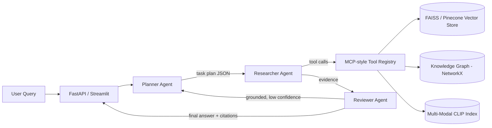

# AI Legal Document Assistant — Agentic RAG System


## Overview

A production-grade, **agentic Retrieval-Augmented Generation (RAG)** system for legal document analysis. Users upload legal PDFs and ask questions; a multi-agent pipeline (Planner → Researcher → Reviewer) decomposes the question, retrieves grounded evidence, and synthesizes a cited, explainable answer — minimizing hallucination and exposing every reasoning step.

Beyond a standard single-shot RAG endpoint, this project demonstrates:

- **Multi-agent orchestration** with LangGraph (Planner / Researcher / Reviewer roles, adaptive multi-hop re-research)
- **Planner & long-horizon task decomposition** — questions are broken into a JSON task plan with per-step status tracking
- **MCP-style tool orchestration** — a uniform tool registry (name/description/schema/handler) for document search, calculators, summarization, and knowledge-graph lookups
- **Multi-modal RAG (text + vision)** — charts/diagrams extracted from PDFs and indexed in a shared CLIP embedding space alongside text
- **Knowledge graphs & NER** — entity-relation graphs built from legal documents (courts, statutes, organizations) with `NetworkX`
- **Pluggable vector backends** — local `FAISS` (zero external dependencies) or cloud `Pinecone`, selected via one environment variable
- **Production hardening** — structured logging, typed exceptions, API-key auth, rate limiting, CORS, health/readiness probes, Docker, CI

## Architecture



### Multi-agent pipeline (LangGraph)

| Agent | Responsibility |
|---|---|
| **Planner** | Decomposes the query into an ordered, explainable sub-task list (LLM-based with a deterministic heuristic fallback) |
| **Researcher** | Executes each sub-task through the tool registry (semantic search, knowledge-graph lookup, etc.) |
| **Reviewer / Coordinator** | Synthesizes a cited answer, scores groundedness against retrieved evidence, and triggers another research hop if the answer is under-supported (bounded by `MAX_REASONING_HOPS`) |

Every step is recorded in an execution **trace** returned to the client for full explainability.

## Tech Stack

| Layer | Technology |
|---|---|
| Orchestration | LangGraph, LangChain |
| Agent tools | Custom MCP-style tool registry |
| Vector search | FAISS (local) or Pinecone (cloud) |
| Embeddings | Sentence-Transformers (`all-MiniLM-L6-v2`, `clip-ViT-B-32`) |
| Generation | IBM WatsonX.ai foundation models |
| Knowledge graph | NetworkX + regex/spaCy NER |
| Multi-modal | PyMuPDF (image extraction) + CLIP |
| API | FastAPI, slowapi (rate limiting) |
| UI | Streamlit |
| Testing | pytest, httpx, pytest-mock |
| Quality | ruff (lint), GitHub Actions (CI) |
| Packaging | Docker, docker-compose |

## Project Structure

```text
ai-legal-assistant/
|-- .env.example
|-- .github/workflows/ci.yml
|-- Dockerfile
|-- Dockerfile.streamlit
|-- docker-compose.yml
|-- pyproject.toml
|-- requirements.txt
|-- tests/
|   |-- conftest.py
|   |-- test_vectorstore.py
|   |-- test_mcp_tools.py
|   |-- test_knowledge_graph.py
|   |-- test_agents.py
|   `-- test_api.py
`-- src/
    |-- config.py                # centralized pydantic-settings configuration
    |-- logging_config.py        # structured logging setup
    |-- exceptions.py            # typed exception hierarchy
    |-- app_fastapi.py           # FastAPI service (auth, rate limiting, CORS, probes)
    |-- rag_pipeline.py          # backend-agnostic retrieval
    |-- rag_watsonx.py           # grounded generation via WatsonX
    |-- ingest.py                # unified chunk -> embed -> index -> graph pipeline
    |-- preprocess_nlu.py        # PDF extraction + IBM NLU enrichment
    |-- chunk_and_embed.py       # chunking + embedding export utility
    |-- streamlit_app.py         # production UI (RAG / Agentic / Graph / Multi-modal tabs)
    |-- vectorstore/
    |   |-- base.py              # BaseRetriever interface
    |   |-- faiss_store.py       # local FAISS backend
    |   |-- pinecone_store.py    # cloud Pinecone backend
    |   `-- factory.py           # get_retriever() backend switch
    |-- agents/
    |   |-- state.py             # shared LangGraph state schema
    |   |-- planner.py           # task decomposition
    |   |-- researcher.py        # evidence gathering via tools
    |   |-- reviewer.py          # synthesis + groundedness check
    |   |-- orchestrator.py      # LangGraph wiring + adaptive loop
    |   `-- mcp_tools.py         # MCP-style tool registry
    |-- graph/
    |   `-- knowledge_graph.py   # entity extraction + graph build/query
    `-- multimodal/
        |-- image_extraction.py # chart/diagram extraction from PDFs
        `-- multimodal_index.py # CLIP-based image similarity index
```

## Setup and Installation

### 1. Clone and install

```bash
git clone https://github.com/Chetanareddy18/AI_Legal_Assistant-.git
cd AI_Legal_Assistant-
pip install -r requirements.txt
```

### 2. Configure environment

```bash
cp .env.example .env
```

At minimum, set `WATSONX_API_KEY`, `WATSONX_URL`, and `WATSONX_PROJECT_ID` to enable LLM-generated answers. Everything else works out of the box with the local FAISS backend — **no cloud account is required to run and test the system.**

### 3. Ingest documents

Place legal PDFs in `data/`, then:

```bash
python -m src.preprocess_nlu   # extract text (+ optional IBM NLU enrichment)
python -m src.ingest           # chunk, embed, index, and build the knowledge graph
```

## Running the Application

### API (FastAPI)

```bash
uvicorn src.app_fastapi:app --reload
```

| Endpoint | Description |
|---|---|
| `GET /health` | Liveness probe |
| `GET /ready` | Readiness probe (checks vector store connectivity) |
| `POST /ask` | Single-shot grounded RAG answer |
| `POST /agent/ask` | Full multi-agent Planner → Researcher → Reviewer pipeline |
| `POST /graph/query` | Knowledge-graph entity neighborhood lookup |
| `POST /multimodal/search` | Combined text + chart/diagram image search |

Protected endpoints accept an `X-API-Key` header when `API_KEY` is set (no-op in local/dev mode).

### UI (Streamlit)

```bash
streamlit run src/streamlit_app.py
```

Four tabs: **Standard RAG**, **Agentic Mode** (live plan + execution trace), **Knowledge Graph** explorer, and **Multi-Modal Search**.

### Docker

```bash
docker compose up --build
```

Spins up the API (`:8000`) and Streamlit UI (`:8501`) with health checks and shared volumes for the FAISS index and extracted documents.

## Testing

```bash
pytest tests/ -v
ruff check src tests
```

The test suite runs fully offline against the local FAISS backend — no API keys or network access required.

## Switching Vector Backends

```env
VECTOR_BACKEND=faiss      # default: local, zero-dependency
VECTOR_BACKEND=pinecone   # cloud-scale: requires PINECONE_API_KEY
```

Both backends implement the same `BaseRetriever` interface, so no application code changes are needed to switch.

## Challenges Addressed

- Cleaning noisy and inconsistently formatted legal PDFs
- Preserving reliable metadata for retrieval quality and citation traceability
- Bounding multi-hop agent loops to avoid runaway reasoning cost
- Keeping multi-modal and knowledge-graph features fully optional/additive so the core RAG path never breaks
- Making the system testable end-to-end without cloud credentials (local FAISS + extractive fallbacks)

## Learning Outcomes

- Designing and shipping a production-style, multi-agent GenAI system end-to-end
- Practical experience with LangGraph state machines, adaptive reasoning loops, and explainable agent traces
- Building an MCP-inspired tool-calling layer for model-agnostic tool orchestration
- Multi-modal retrieval with joint text/image embedding spaces (CLIP)
- Knowledge graph construction and querying with NetworkX
- Hardening an ML service for production: auth, rate limiting, structured logging, health probes, Docker, CI

## Future Improvements

- Real MCP server/client protocol implementation for cross-process tool sharing
- True DAG-based (parallel, dependency-aware) planning instead of sequential steps
- Vision-language model integration (LLaVA / GPT-4V) for grounded chart reasoning
- User authentication (OAuth) and persistent per-user query history
- Cloud deployment (AWS/Azure/GCP) with managed vector database and autoscaling

## References

- LangChain / LangGraph Documentation
- Pinecone Documentation
- IBM WatsonX.ai Documentation
- Sentence-Transformers / CLIP Documentation
- Model Context Protocol (MCP) Specification
